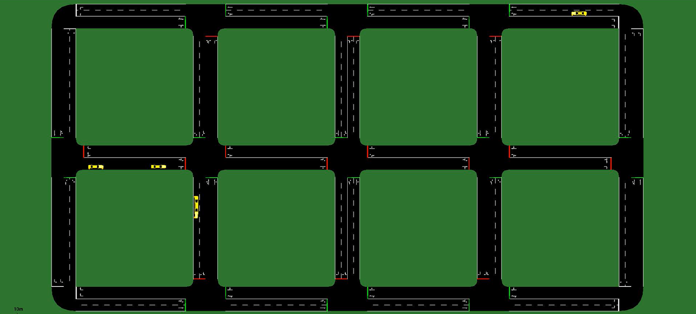

# Traffic-Light-Control-with-CNN-RL

## Project Overview

This project demonstrates the optimization of traffic light control using reinforcement learning (RL) with Convolutional Neural Networks (CNNs). A Dockerfile is provided in the repository to manage dependencies and ensure consistent versions for running the project.

---

## Scenario

The simulation environment is a grid layout with:

- 3 horizontal streets and 5 vertical streets  
- 75 meters distance between each street  
- 3 vehicle types: car, bus, and truck  
- Scenarios with varying traffic densities

  

---

## Training

The training was performed using the `Train_CNN.py` script. The neural network input consists of a stack of the last 3 observed states for each traffic light, allowing the model to capture temporal dependencies and optimize traffic flow using multi-agent PPO.

---

## Testing & Results

For testing, the trained CNN model was compared with traditional traffic light controllers. Metrics evaluated include:

- Average waiting time per vehicle  
- Average vehicle speed  

The results demonstrate a clear improvement over traditional traffic lights, with confidence intervals included in the plots.


---

## Getting Started

1. **Build Docker container**  

```bash
docker build -t traffic_cnn_rl:latest .
```

2. **Run Docker container**
```bash
docker run -it --rm traffic_cnn_rl:latest
```
3. **Run training or evaluation scripts**
```bash
python Train_CNN.py
python Utils/Evaluation_CNN.py
python Utils/Evaluation_CNN_Temp.py 
```


